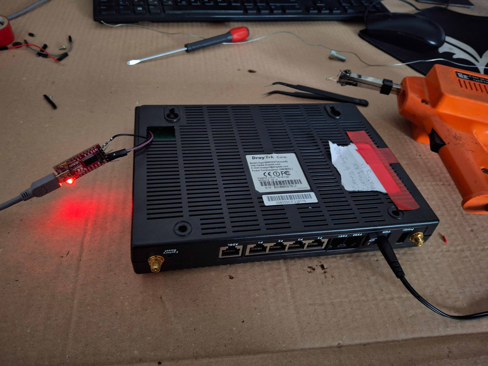
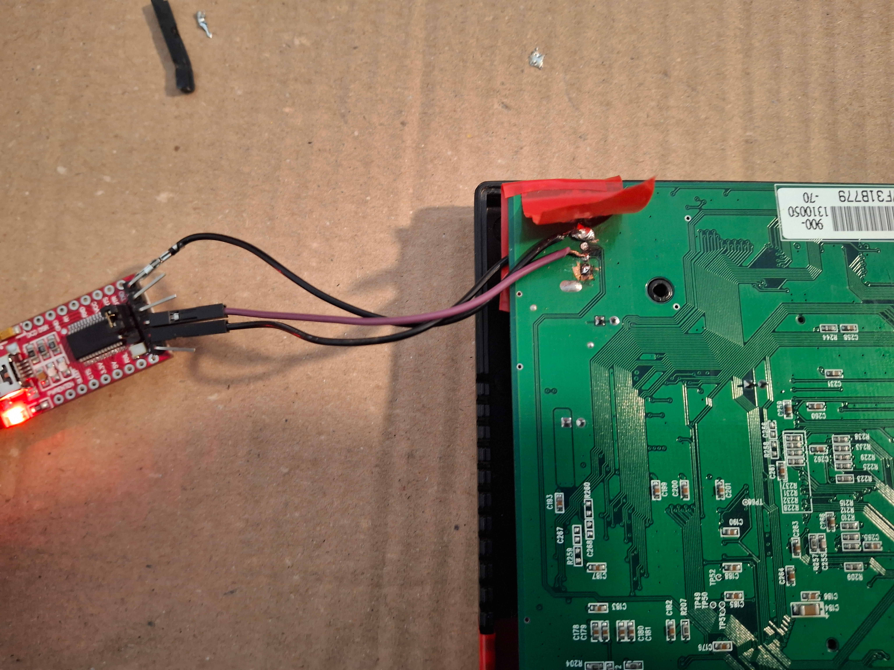

# DrayTek Vigor2600VGST — UART Reverse Engineering & Repurposing

**Target:** DrayTek Vigor2600VGST (AnnexB)  
**Firmware:** v2.5.8_ST (built Wed Dec 14 14:42:38 2005)  
**Acquired:** Free — abandoned hardware destined for trash  
**Goal:** Gain full administrative access and repurpose as a WiFi AP + managed switch

---

## Hardware

| Component | Chip | Function |
|---|---|---|
| Main CPU | ARM SoC | Primary processor |
| ADSL | Analog Devices AD6485JST (Eagle) | ADSL DMT transceiver |
| Switch | Kendin KS8995XA | 5-port 10/100 managed switch |
| Flash | TSOP-48 (SQ-H48V marked) | Main NOR flash |
| WiFi | Atheros MiniPCI (ATHG, 94b644) | 802.11g |
| VoIP | MC401-136-1200-04 | FXS analog phone ports |
| EEPROM | Macronix MX93LV1280A | Config storage |




---

## Tools Used

- UART to USB adapter
- Jumper wires
- minicom (terminal emulator)
- curl, wget, ping
- Custom fish shell scripts for HTTP endpoint enumeration

---

## Step 1 — UART Access & The Log Problem

The board exposes an unpopulated 4-pin UART header. Connected UART adapter (3.3V logic) at **115200 8N1**.

This is where things immediately got confusing. The device does not produce clean sequential boot output — multiple hardware subsystems (ISDN, ADSL, VoIP, switch) all print their own diagnostic messages asynchronously, interleaving with each other and with any management prompts. The result looks like this:

```
Press key to stop booting
ISDN: i=55, j = 7f
ISDN: i=55, j = ff
ISDNDO YOU WANT TO CHANGE THE DEFAULT USER NAME PASSWORD ? Y/N :
*** ADI Firmware version : 40e4bea9 ***
ISDN: i=55, j = ff
*** Set Adsl Link Param!***
Ver=15 >>0: 0x80000066, 1: 0x00000994, FDQ: 0x04003028,
         4: 0x00000000, 5: 0x00000500, Ctrl: 0x26870030,
SetCountryTone: country=0CMCIA CARD DETECTED=========
 i=5dc, ISAC_MODE_=ff, R_D_TEI1=ff, R_D_TEI2=ffWireless device 94b644(ATHG) detect!
[processPhone]: channelId=0 ON_HOOK
** Chan=0 VPI=1 VCI=32 Align=0 Active=1**
**ADSL Eagle Reset!**
**ADSL Eagle Reset!**
```

Notice `ISDNDO YOU WANT TO CHANGE THE DEFAULT USER NAME PASSWORD ? Y/N :` — the prompt does not appear on its own line. It is printed mid-stream, directly after an ISDN log prefix, making it easy to question whether it was already gone by the time you noticed it.

---

## Step 2 — Boot Interruption & Brute Force Attempt

Knowing this device has a bootloader interrupt window (`Press key to stop booting`), the first approach was to interrupt boot and access a deeper diagnostic shell. Pressing a key during that window drops into the interrupted boot path:

```
##INTERRUPTED BOOT##
Press key to stop booting
ISDN: i=55, j = 7f
ISDN: i=55, j = ff
ISDN: i=55, j = ff
ISDN: i=55, j = ff
ISDN: i=55, j = ff
ISDN: i=55, j = ff
 Please Type Password:
```

The bootloader is password protected. Attempted common defaults — blank, `admin`, `1234`, `draytek`, `vigor`, `password` — none worked. The shell gives no feedback on incorrect attempts whatsoever. It simply does not respond, making it impossible to tell whether input was even being received. After exhausting reasonable guesses the interrupted boot path was abandoned.

---

## Step 3 — Back to Normal Boot & Interacting With the Prompt

Returning to the normal boot path, the focus shifted to the `DO YOU WANT TO CHANGE THE DEFAULT USER NAME PASSWORD ? Y/N :` prompt. It had been spotted in the logs — the question was not whether it existed, but whether interacting with it was even possible given the chaos around it.

The prompt appears buried mid-line inside ISDN output, not on a clean new line, which made it hard to be certain whether it was still waiting for input or had already timed out by the time the following log lines appeared.

Typing `Y` and entering a new password made things even less clear. The boot log keeps printing over everything, and the device's response to the password input gets completely shredded by concurrent output from other subsystems. Instead of a clean `New Password:` prompt, what actually appeared in the terminal was:

```
ISDNDO YOU WANT TO CHANGE THE DEFAULT USER NAME PASSWORD ? Y/N :
*** ADI Firmware version : 40e4bea9 ***
ISDN: i=55, j = ff
*** Set Adsl Link Param!***
Ver=15 >>0: 0x80000066, 1: 0x00000994, FDQ: 0x04003028,
         4: 0x00000000, 5: 0x00000500, Ctrl: 0x26870030,
SetCountryTone: country=0CMCIA CARD DETECTED=========
i=5dc, ISAC_MODE_=ff, R_D_TEI1=ff, R_D_TEI2=ffWireless device 94b644(ATHG) detect!
SNetwCoPassunword: tryTone: code=25
V2600B is Correct! BL ver=c007
[processPhone]: channelId=0 ON_HOOK
** Chan=0 VPI=1 VCI=32 Align=0 Active=1**
##processPhone: channelId=0,unknown state=0
LPD_task()>>>>>
[processPhone]: channelId=1 ON_HOOKated
##processPhone: channelId=1,unknown state=0
```

That fragment `SNetwCoPassunword: tryTone: code=25` is the `New Password:` prompt, broken apart and interleaved character-by-character with `SetCountryTone: try code=25` being printed by the ADSL subsystem at the exact same moment. The password prompt was not missing — it was physically present in the output, just completely unreadable.

The password change was confirmed to have worked when the management menu eventually appeared. Also interleaved with boot messages, heres readable version:

```
Vigor2200 by DrayTek Corp.
==========================
LAN MAC Address  : 00-50-7F-31-B7-79
IP Address       : 192.168.1.1
IP Subnet Mask   : 255.255.255.0
Firmware Version : v2.5.8_ST

-------- Main Menu --------
1 : Change IP Address and Subnet Mask
2 : Change Administrator Password
3 : Reboot System
4 : Enable TFTP Server
5 : Restore to Default Management Port
Please Select Item :
```

Used option `1` to change the device IP — it defaults to `192.168.1.1` which conflicted with the existing network gateway — then connected via ethernet.

---

## Step 4 — Web UI Access & Enumeration

With network access confirmed, accessed the web UI via browser using basic auth with the password set over UART. Without the UART session this would have been completely inaccessible — there is no default password and no way into the web interface without first going through the serial console.

Full menu structure was extracted from the page HTML source, revealing all available CGI endpoints and configuration pages across basic settings, advanced networking (NAT, firewall, VPN, VoIP, VLAN), and system management.

### Attempted config dump — CVE-2013-2309

Older DrayTek firmware (v2.x) serves the full config including credentials unauthenticated at `/rom-0`. Tested on this device:

```bash
wget http://<device-ip>/rom-0
# 404 Not Found
```

Patched on v2.5.8_ST. TFTP was also confirmed upload-only — it exists for firmware flashing, not config download.

---

## Outcome

Full administrative access achieved via UART alone, no additional hardware required.

Device repurposed as a WiFi AP and managed switch. The Atheros MiniPCI card provides 802.11g wireless and the KS8995XA provides 5-port managed switching with VLAN support accessible via the web UI.

---

## Key Lessons

- **The prompt is there — the interaction with it is what is obscure.** The `Y/N` prompt appears mid-line inside ISDN output and the subsequent password entry gets shredded by concurrent subsystem printing. What looks like `SNetwCoPassunword: tryTone: code=25` is actually `New Password:` merged character-by-character with `SetCountryTone: try code=25`.
- **Silent input during boot is intentional, not a sign of failure.** The device accepts keystrokes while continuing to print log output. No echo, no confirmation — input is being received even when nothing appears to happen.
- **The bootloader password prompt gives no feedback on wrong attempts.** The only indication of failure is that the shell never opens.
- **TTL=255 in ping response** confirms custom RTOS, not Linux.
- **CVE-2013-2309 is patched** in v2.5.8_ST. Present in earlier v2.x releases.

